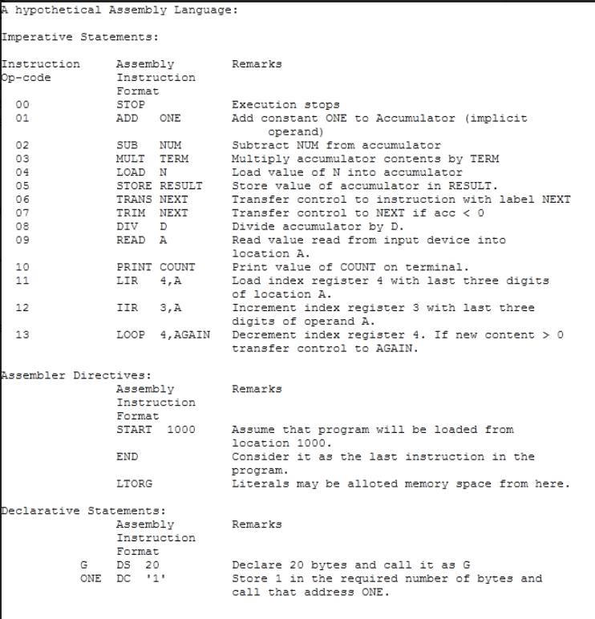

# ASSIGNMENT 1

Write a lexical analyser for the assembly language described in the file attached. The program should take as input a text file containing an assembly program and print the stream of token values corresponding to the items in the input file. For identifiers and numbers the actual input item should also appear within brackets along with the token value. e.g. the output may look like:

17 20(100) 21(AGAIN) 14 20(3) 21(TERM) ....

Write the program once in plain C, and once using flex utility (later).

`Create the file token.h to put the token definitions. In the plain C implementation, you should also define the mnemonic table containing the mnemonic strings and the corresponding numeric token values.`

  

